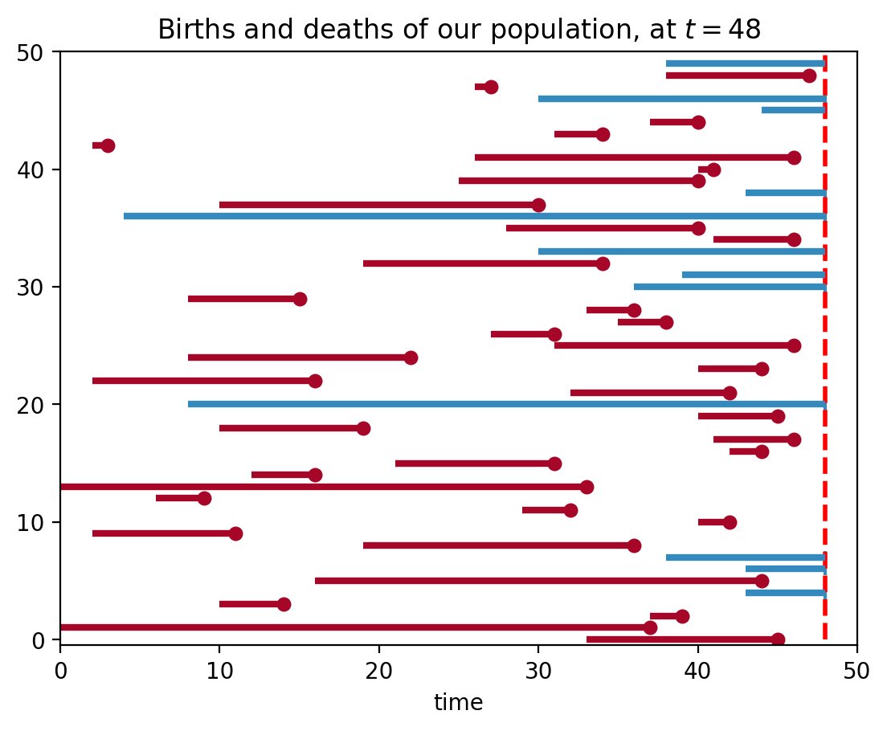
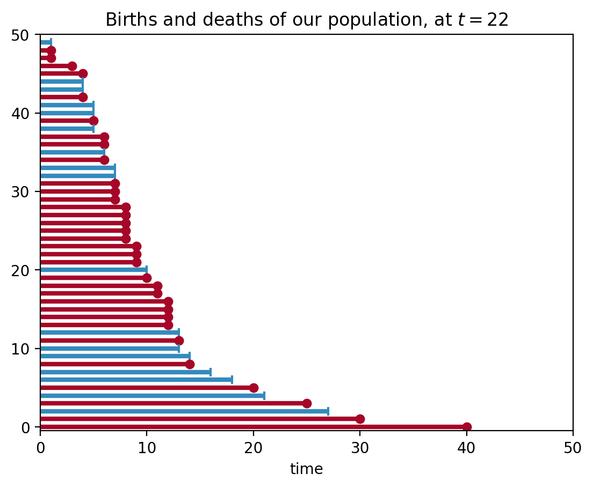
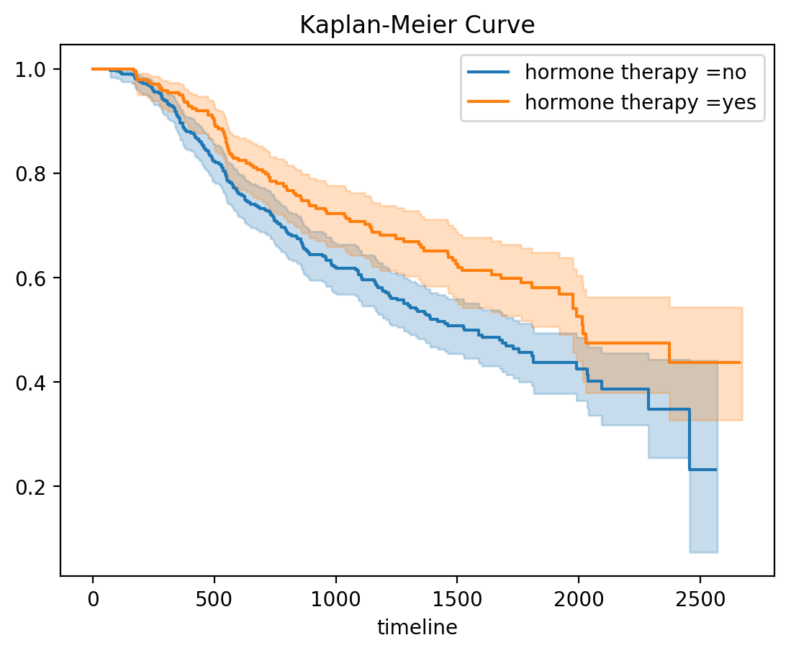
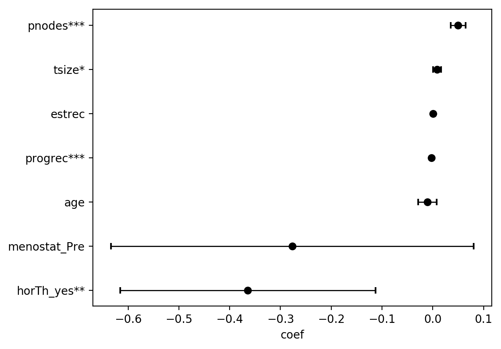

# はじめに

## 書こうと思ったきっかけ

実習中論文を頂いて読む機会が多いが、医学論文は薬は新しい治療方法の成績を比較しているのが多い。
だいたいKaplan-Meier曲線が使われているので(偏見)、論文を読むときにはもちろん、将来自分が論文を執筆するときに、何が行われているのか少しでも理解できていればいいかなと思いまとめてみた。

## Kaplan-Meier 曲線とは

[wikipedia](https://ja.wikipedia.org/wiki/%E7%94%9F%E5%AD%98%E7%8E%87%E6%9B%B2%E7%B7%9A)によると「治療を行った後の患者の生存率をグラフにしたもの」ということらしい。
ただ、実際には問題がいくつかあって

* 観察期間は限られている(患者さんを何年もフォローすることはできない)
* 観察不能になることがある(病院移った、他の要因で死亡したなど)
* 患者さんによって観察開始時間は様々(みんな一緒に罹患したり治療を開始するわけではない)

そういった問題をうまく対処してくれるのがKaplan-Meier曲線。


Kaplan-Meier曲線の縦軸は累積生存率で、
$$
  S(t) = \prod_{j}^t (1-\frac{d_j}{n_j})
$$
で表されます。
ここで$d_j$は時間jにおける死亡者数で$n_j$は時間jにおける生存者数です。

pythonのコードでKaplan-Meier曲線を書いていこうと思います。
pythonのライブラリにlifelinesという便利なライブラリがあるのでそれを使っていこうと思います。


``pip install lifelines``

# データの準備

ある病気に対する治療法の予後のKaplan-Meier曲線を描きたいとします。
ある期間内に観察された患者の経過をみることになると思いますが、患者さんによって発症する時間も様々なので、イメージとして下の図のようになると思います。


```python
import pandas as pd
import numpy as np
import matplotlib.pyplot as plt
from lifelines import KaplanMeierFitter
from lifelines.plotting import plot_lifetimes
from numpy.random import uniform, exponential
%matplotlib inline
%config InlineBackend.figure_format = 'retina'

N = 50
current_time = 48
birth = np.random.randint(0,45,50)
actual_lifetimes = np.array([[int(exponential(20))+1, int(exponential(10))+1][uniform() < 0.5] for i in range(N)])
observed_lifetimes = np.minimum((actual_lifetimes+birth), current_time)
observed = (birth + actual_lifetimes) < current_time

plt.xlim(0, 50)
plt.vlines(48, 0, 50, lw=2, linestyles='--',colors='red')
plt.xlabel("time")
plt.title("Births and deaths of our population, at $t=48$")
plot_lifetimes(observed_lifetimes-birth, event_observed=observed,birthtimes=birth)
print("Observed lifetimes at time %d:\n" % (current_time), observed_lifetimes)
```





    Observed lifetimes at time 48:
     [48 47 27 48 48 40 34  3 46 41 40 48 30 48 40 46 48 34 48 48 15 36 38 31
     46 22 44 16 42 48 45 19 46 44 31 16 33  9 32 42 11 36 48 48 44 48 14 39
     37 45]


赤線では期間内(t=48)に患者さんが死亡したケース、青線は観測不能になったケースです(観察期間終わったからそれ以上追えない)。

簡単のため、観測不能になったケースは観測期間が終わった場合のみとします。観察期間の長さでソートすると、下の図のようになります。


```python
s = pd.Series(observed_lifetimes-birth,observed)
s = s.sort_values()
s.name = 'time'
observed, result_lifetimes = s.index, s.values

plt.xlim(0,50)
#plt.vlines(22, 0, 30, lw=2, linestyles='--',colors='red')
plt.xlabel("time")
plt.title("Births and deaths of our population, at $t=22$")
plot_lifetimes(result_lifetimes, event_observed=observed)
```





# 実際の計算

さっき作ったデータを使って、累積生存率を計算していきます。たとえばt=5における累積生存率を計算するとき、


```python
pd.DataFrame(s).head(12)
```


<div>
<style scoped>
    .dataframe tbody tr th:only-of-type {
        vertical-align: middle;
    }

    .dataframe tbody tr th {
        vertical-align: top;
    }

    .dataframe thead th {
        text-align: right;
    }
</style>
<table border="1" class="dataframe">
  <thead>
    <tr style="text-align: right;">
      <th></th>
      <th>time</th>
    </tr>
  </thead>
  <tbody>
    <tr>
      <th>False</th>
      <td>1</td>
    </tr>
    <tr>
      <th>True</th>
      <td>1</td>
    </tr>
    <tr>
      <th>True</th>
      <td>1</td>
    </tr>
    <tr>
      <th>True</th>
      <td>3</td>
    </tr>
    <tr>
      <th>True</th>
      <td>4</td>
    </tr>
    <tr>
      <th>False</th>
      <td>4</td>
    </tr>
    <tr>
      <th>False</th>
      <td>4</td>
    </tr>
    <tr>
      <th>True</th>
      <td>4</td>
    </tr>
    <tr>
      <th>False</th>
      <td>5</td>
    </tr>
    <tr>
      <th>False</th>
      <td>5</td>
    </tr>
    <tr>
      <th>True</th>
      <td>5</td>
    </tr>
    <tr>
      <th>False</th>
      <td>5</td>
    </tr>
  </tbody>
</table>
</div>


Trueが患者さんが死亡したのを観測できた事例、Falseが観察期間終了により観測できなかった事例です。観察期間の短い順に見ていくと、  
t=1のとき、50人のうち2人が死亡,1人が打ち切り。  
t=3の時は４７人のうち１人が死亡。  
t=4の時は46人のうち２人が死亡、２人が打ち切り。  
t=5の時は42人中１人死亡、３人が打ち切り。
よって$S(5)$は　　
$$
  S(5) = (1-\frac{1}{50})(1-\frac{1}{47})(1-\frac{2}{46})(1-\frac{1}{42})
       = 0.8956028368794325
$$
となります。

# 結果のプロット

ここら辺の計算と描画はライブラリに任せます。  
やってることは各期間の点における累積生存率をプロットして線を横に伸ばすだけです。


```python
kmf = KaplanMeierFitter()
kmf.fit(result_lifetimes,event_observed=observed)
kmf.plot()
plt.title('Survival function of political regimes');
```


# 乳がんデータセットを用いて解析を行った例

一応これで生存曲線は描けた訳ですが、もし治療の有効性を示すのであれば、他の治療群と比較して、有効性を示さなければいけません。  
ここから使われる統計手法はLog-rank検定、一般化wilcoxon検定など様々ですが、ここではcox比例ハザードを使った回帰分析を例にして解析を進めていきます。  
cox比例ハザードモデルに関する説明は[ここ](http://www012.upp.so-net.ne.jp/doi/biostat/CT39/Cox.pdf)がわかりやすかった。  
lifelinesライブラリに乳がんの予後のデータセットがあるのでそれを用います。  
乳がんの治療でどのような因子が予後のに影響を及ぼすのか調べてみます。


```python
# hormone therapyの有無で2群に分けKaplan-Meier曲線を描いた例
from lifelines.datasets import load_gbsg2
df = load_gbsg2()
ax = None
for name, group in df.groupby('horTh'):
    kmf = KaplanMeierFitter()
    kmf.fit(group['time'], event_observed=group['cens'],
            label = 'hormone therapy =' + str(name))
    # 描画する Axes を指定。None を渡すとエラーになるので場合分け
    if ax is None:
        ax = kmf.plot()
    else:
        ax = kmf.plot(ax=ax)
plt.title('Kaplan-Meier Curve')
plt.show()
```





```python
from lifelines import CoxPHFitter
cph = CoxPHFitter()
df = pd.get_dummies(df,columns=['horTh','menostat'],drop_first=True)
df.drop('tgrade',axis = 1,inplace = True)
cph.fit(df, duration_col='time', event_col='cens', show_progress=True)

```

    Iteration 1: norm_delta = 0.63685, step_size = 0.95000, ll = -1788.10474, seconds_since_start = 0.0
    Iteration 2: norm_delta = 0.28516, step_size = 0.95000, ll = -1781.26562, seconds_since_start = 0.0
    Iteration 3: norm_delta = 0.09501, step_size = 0.95000, ll = -1745.22376, seconds_since_start = 0.1
    Iteration 4: norm_delta = 0.02423, step_size = 0.95000, ll = -1740.89966, seconds_since_start = 0.1
    Iteration 5: norm_delta = 0.00263, step_size = 0.95000, ll = -1740.66192, seconds_since_start = 0.1
    Iteration 6: norm_delta = 0.00015, step_size = 0.95000, ll = -1740.65941, seconds_since_start = 0.1
    Iteration 7: norm_delta = 0.00001, step_size = 0.95000, ll = -1740.65940, seconds_since_start = 0.1
    Convergence completed after 7 iterations.


    <lifelines.CoxPHFitter: fitted with 686 observations, 387 censored>


```python
cph.print_summary()
```

    n=686, number of events=299
    
                    coef  exp(coef)  se(coef)       z      p  lower 0.95  upper 0.95     
    age          -0.0105     0.9896    0.0093 -1.1296 0.2587     -0.0287      0.0077     
    tsize         0.0084     1.0084    0.0039  2.1173 0.0342      0.0006      0.0161    *
    pnodes        0.0498     1.0511    0.0074  6.7329 0.0000      0.0353      0.0643  ***
    progrec      -0.0026     0.9974    0.0006 -4.4522 0.0000     -0.0037     -0.0015  ***
    estrec        0.0002     1.0002    0.0005  0.3843 0.7008     -0.0007      0.0011     
    horTh_yes    -0.3643     0.6947    0.1284 -2.8371 0.0046     -0.6159     -0.1126   **
    menostat_Pre -0.2767     0.7583    0.1822 -1.5191 0.1287     -0.6338      0.0803     
    ---
    Signif. codes:  0 '***' 0.001 '**' 0.01 '*' 0.05 '.' 0.1 ' ' 1 
    
    Concordance = 0.687
    Likelihood ratio test = 94.891 on 7 df, p=0.00000


```python
cph.plot()
```


    <matplotlib.axes._subplots.AxesSubplot at 0x1a20f189e8>





# まとめ

Kaplan-Meier曲線がどのように作られているか分かった。  
pythonを用いて割と簡単に統計解析ができた。  
統計モデルについても定義からもう少し詳しく説明できたらよかったが、latex使うのめんどくさくて諦めた。リンク参考にしてください。  

### 参考文献  
https://lifelines.readthedocs.io/en/latest/index.html  
https://istat.co.jp/sk_commentary/kaplan_meier  
http://www.emalliance.org/%E6%9C%AA%E5%88%86%E9%A1%9E/%E7%AC%AC%EF%BC%97%E5%9B%9Eema-jc%E3%80%80%E8%A7%A3%E8%AA%AC%E3%80%80%E3%82%AB%E3%83%97%E3%83%A9%E3%83%B3%E3%83%9E%E3%82%A4%E3%83%A4%E3%83%BC%E7%94%9F%E5%AD%98%E6%9B%B2%E7%B7%9A
